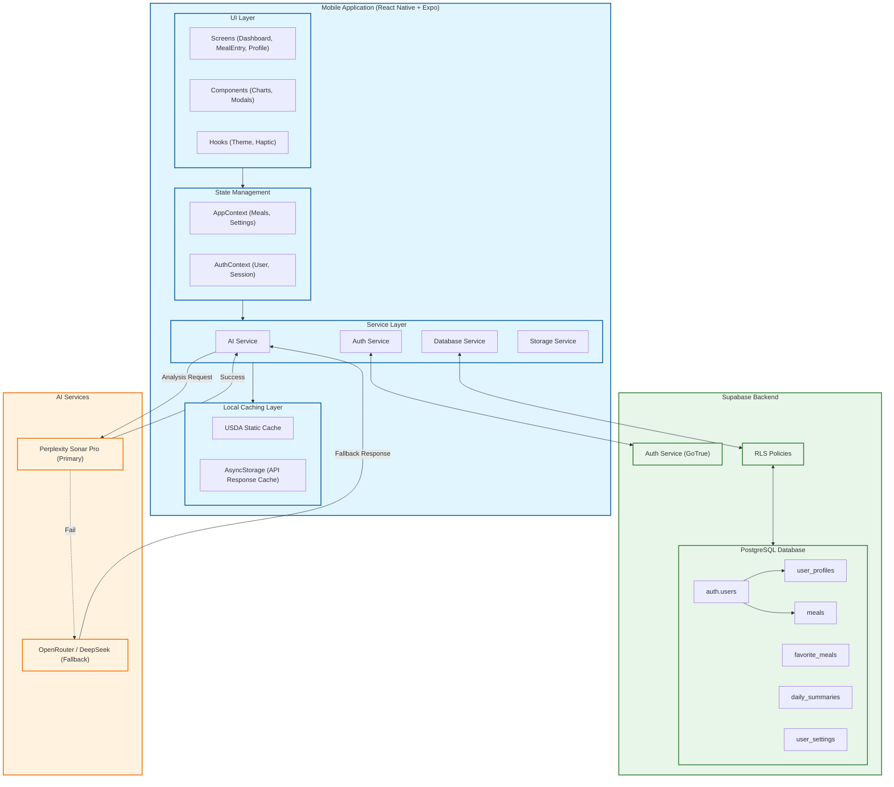

# FoodSense Architecture Diagram



## AI Nutrition Analysis Pipeline

```mermaid
flowchart TD
    Start([User Input: "grilled chicken..."]) --> StaticCache{Check Static Cache\n(USDA DB)}
    
    StaticCache -- Hit --> ReturnResult([Return Cached Nutrition])
    StaticCache -- Miss --> APICache{Check API Cache\n(AsyncStorage)}
    
    APICache -- Hit --> ReturnResult
    APICache -- Miss --> Queue[Request Queue\n(Rate Limiting)]
    
    Queue --> PrimaryAI{Call Primary AI\n(Perplexity Sonar)}
    
    PrimaryAI -- Success --> Process[Process Response\nParse & Validate]
    PrimaryAI -- Fail --> FallbackAI{Call Fallback AI\n(OpenRouter)}
    
    FallbackAI -- Success --> Process
    FallbackAI -- Fail --> Error([Return Error])
    
    Process --> CacheNew[Cache Result]
    CacheNew --> ReturnResult
```
